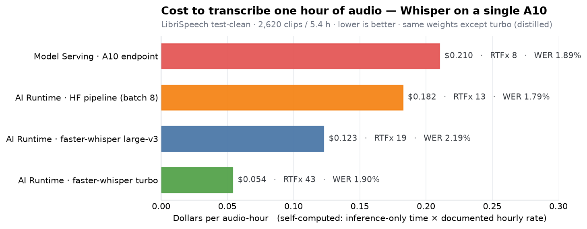

# whisper-benchmarking

Price/performance benchmarking of **Whisper batch inference on Databricks**. It measures, on identical
audio and (where possible) identical model weights, what it actually costs to transcribe an hour of
audio across two architectures and several inference engines — and lands the numbers in documented,
reproducible Delta tables.

The guiding question: **how low can `$/audio-hour` go while keeping accuracy under a 2.5% WER ceiling?**

---

## TL;DR

- **The cheapest config transcribes an hour of audio for ~$0.054** — Whisper `large-v3-turbo`
  on **faster-whisper (CTranslate2)**, running on a single **A10** via **AI Runtime** serverless GPU.
  That's **~4× cheaper than the Model Serving endpoint** (~$0.21/audio-hr) at essentially the same accuracy.
- **The engine and the model are the cost levers, not the platform.** Same A10, same weights: swapping
  the HuggingFace `transformers` pipeline for faster-whisper cut cost ~33%; swapping `large-v3` for the
  distilled `turbo` cut it another ~56%.
- **A10 is the measured cost winner.** The H100 is faster but bills ~2.8× more per hour, so it only wins if
  throughput scales past that bar — and it wasn't benchmarked representatively here (see [A10 vs H100](#a10-vs-h100)).
- **For long calls, the next lever is batched decoding within each call** (`BatchedInferencePipeline`) —
  not yet in the committed harness; see [Conclusions](#conclusions--recommendations).

---

## Results



*Full LibriSpeech `test-clean` — 2,620 clips / 5.40 h — on a single A10. Bars are self-computed cost per
audio-hour (lower is better); each is annotated with throughput (RTFx) and normalized WER. All bars share
the same weights **except** turbo, which is a distilled model.*

### The leaderboard

Every row below is a real full-dataset run whose numbers live in `whisper_bench_summary` and are
reproducible from this repo. Sorted cheapest first. WER/CER are post-Whisper-normalizer; both arms hold
the same ~1.8–2.2% band, so the cost comparison is apples-to-apples.

| Config | Arm | Engine | Model | Batch / Conc. | RTFx | WER | CER | **$/audio-hr** | Total $ (5.4 h) |
|---|---|---|---|---:|---:|---:|---:|---:|---:|
| turbo | AI Runtime | faster-whisper | `large-v3-turbo` | bs 1 | **43.4** | 1.90% | 0.62% | **$0.054** | $0.291 |
| fw large-v3 | AI Runtime | faster-whisper | `large-v3` | bs 1 | 19.1 | 2.19% | 0.93% | $0.123 | $0.663 |
| HF bs8 | AI Runtime | HF pipeline | `large-v3` | bs 8 | 12.8 | 1.79% | 0.60% | $0.182 | $0.985 |
| HF bs4 | AI Runtime | HF pipeline | `large-v3` | bs 4 | 12.0 | 1.78% | 0.60% | $0.195 | $1.053 |
| serving c2 | Model Serving | endpoint | `large-v3` | c 2 | 8.3 | 1.89% | 0.66% | $0.210 | $1.135 |
| serving c4 | Model Serving | endpoint | `large-v3` | c 4 | 8.3 | 1.89% | 0.66% | $0.210 | $1.135 |
| serving c1 | Model Serving | endpoint | `large-v3` | c 1 | 7.9 | 1.89% | 0.66% | $0.219 | $1.183 |

Read it top to bottom and the whole story is there: **serving → AI Runtime with the HF pipeline → the same
box with faster-whisper → the distilled turbo model** roughly halves cost at each step, without moving WER.

---

## Key concepts

Short glossary of everything the leaderboard is comparing.

### AI Runtime vs Model Serving

Two different ways to run a GPU model on Databricks:

- **Model Serving** — a persistent **REST endpoint** deployed from a Unity Catalog model
  (`system.ai.whisper_large_v3`). You send audio, it returns transcripts. Great for online/low-latency
  serving; you pay for the endpoint while it's up. Here it's billed as *Serverless Real-Time Inference*.
  For batch, the lever is **concurrency** — how many requests you keep in flight against a replica.
- **AI Runtime (serverless GPU)** — a **batch job** that runs your own Python on a serverless GPU
  accelerator (`GPU_1xA10`, `GPU_1xH100`), driven by a Databricks Asset Bundle `ai_runtime_task`. No Spark,
  no endpoint — just your script on a GPU, reading files and writing results. Built for exactly this kind
  of throughput-oriented batch transcription. *(Public Preview.)*

For **batch** transcription, AI Runtime wins here: you control the inference engine and batching, and it
saturates the GPU better than single-request serving.

### faster-whisper vs the HF pipeline

Two inference **engines** running the *same weights*:

- **HF pipeline** — HuggingFace `transformers` `AutomaticSpeechRecognitionPipeline`. The reference
  implementation; convenient, but memory-hungry and not the fastest (batch > 8 OOMs a 24 GB A10 under fp16).
- **faster-whisper** — a reimplementation on **CTranslate2**, a C++ inference engine with quantization
  (`float16`, `int8_float16`, `int8`) and much lower memory use. **Same `large-v3` weights, ~1.5× the
  throughput** at the same accuracy — which is why it's the recommended engine here.

### large-v3 vs turbo

Two **models**:

- **`large-v3`** — the full 1.5 B-parameter Whisper. The accuracy reference; every non-turbo row runs it.
- **`large-v3-turbo`** — a **distilled** variant with a much smaller *decoder* (4 layers vs 32). ~2× faster,
  and on clean English it was even slightly *more* accurate than `large-v3` faster-whisper here.
  It's a genuinely different model, so it deliberately **breaks same-model parity** — that's why it's recorded
  under its own model id and treated as an accuracy-vs-cost study, not an apples-to-apples engine swap.

### A10 vs H100

Two **GPUs**. The A10 (24 GB) is the cheap workhorse; the H100 (80 GB) is far more powerful and bills far
more per hour (~2.8× the A10's hourly rate here). Because **`$/audio-hr = hourly_rate ÷ RTFx`**, a faster GPU
only wins if its throughput rises *faster* than its price — the H100 has to clear ~2.8× the A10's RTFx just to
break even on cost. There's no representative H100 benchmark here (and its hourly rate is an unmeasured
placeholder), so the **A10 is the measured cost winner**. The H100's 80 GB — which enables much larger batches
on long audio — makes it worth a re-test once its rate is calibrated.

### The 30-second window (and batching)

Whisper's encoder is **fixed at 30 seconds**: audio is processed in 30 s mel windows. This shapes how each
engine batches, which is why the two AI Runtime arms batch differently:

- **HF pipeline** batches by padding *separate clips* to 30 s and stacking the tensors (the bs4/bs8 rows).
  It's encoder-bound and wastes compute on padding when clips are short of 30 s — which is why bs4 → bs8 barely
  moved throughput here.
- **faster-whisper** doesn't batch that way: `WhisperModel.transcribe()` is **single-stream** (one recording
  at a time), so the committed runner is sequential and `batch_size` is a no-op there. Its batching lives in
  `BatchedInferencePipeline`, which VAD-segments *one* recording into 30 s windows and decodes several in
  parallel.

For a **long call**, that intra-call window-batching is the real throughput lever — a 30–60 min call is dozens
of 30 s windows, batched — and it's the recommended next step (see [Conclusions](#conclusions--recommendations)).

### RTFx and the cost identity

- **RTFx (real-time factor)** = `seconds_of_audio ÷ seconds_of_inference`. RTFx 30 means 30 s of audio
  transcribed per wall-second. **Higher is faster.**
- **The cost identity:** `$/audio-hr = hourly_rate ÷ RTFx`. Everything in this repo is an attack on one side
  of it — push RTFx up (better engine, model, batching) or find a cheaper saturable GPU-hour.

---

## How cost is computed

Cost here is **self-computed**, not read from `system.billing.usage`. Billing tables bill the whole job —
model download, cluster/endpoint spin-up, warmup — and land ~12 h late, which would swamp the actual
inference cost of a short benchmark. Instead:

1. We time **only the transcription loop** (`inference_wall_sec`). Setup is timed separately and **excluded**.
2. `cost = inference_wall_sec / 3600 × documented $/hr`, where the rate comes from a **versioned catalog**
   ([`conf/compute_costs.yml`](conf/compute_costs.yml)) whose `$/DBU` figures are pulled live from
   `system.billing.list_prices`, and persisted alongside the results so **every dollar is reproducible from
   the tables alone**.
3. The **serving arm counts both computes**: the GPU endpoint *and* the orchestration job driving it.

The rates behind the numbers above (AWS `us-east-1`, Enterprise tier, catalog `2026-09-25.2`):

| Compute | Product / SKU | $/DBU | DBU/hr | **$/hr** | Basis |
|---|---|---:|---:|---:|---|
| AI Runtime · A10 | `AI_RUNTIME` (Model Training) | 0.65 | 3.6 | **$2.34** | measured, isolated run (±~15%) |
| AI Runtime · H100 | `AI_RUNTIME` | 0.65 | 10.0 | $6.50 | ⚠︎ **unmeasured placeholder** |
| Serving · A10 endpoint | Serverless RT Inference | 0.07 | 20.0 | $1.40 | measured (endpoint billing) |
| Serving · orchestration | Serverless Jobs | 0.45 | 0.75 | $0.34 | measured (driver task) |

Note the A10 costs *more* per hour under AI Runtime ($2.34) than as a serving endpoint ($1.40) — yet still
wins on `$/audio-hr`, because the batch engines extract several times the throughput. **The throughput, not
the hourly rate, is what moves the cost.**

> Relative comparisons across batch size / concurrency on the *same* compute are exact regardless of rate
> precision. Only cross-compute *absolute* dollars depend on the DBU/hr figures — so calibrate the two
> placeholder/`verify: docs` rates before quoting absolute cross-GPU costs externally.

---

## Assumptions & caveats

- **The dataset is LibriSpeech `test-clean`: short, clean, read English.** 2,620 clips, 5.40 h total, mean
  ~7.4 s / clip (max ~35 s), 16 kHz mono. It's ideal for a *speed/cost* benchmark and for cross-arm accuracy
  *parity*, but it is **not representative of real support calls** (10–60 min, spontaneous speech, two+
  speakers, telephony noise, channels). **The ~1.8–2.2% WER numbers will not transfer to that domain** —
  expect materially higher WER on real calls, and note this harness has **no diarization or 2-channel
  handling** yet.
- **The cross-run comparison is still apples-to-apples.** Every config processes the *same* clips the *same*
  way — each padded to its own 30 s encoder window — so they all carry the identical short-clip padding
  penalty. That makes the **relative** ranking (engine, model, GPU, concurrency) robust. The penalty inflates
  the **absolute** $/audio-hr roughly proportionally for all of them, so treat these dollar figures as a
  **conservative (upper-bound) proxy** for long calls: filled 30 s windows lower the cost for every config,
  and the ranking is expected to hold.
- **Cost transfers to long calls; accuracy does not.** `$/audio-hr` is length-invariant, so the ~$0.05–0.21
  range here is a reasonable order-of-magnitude expectation for long calls (~$0.03 for a 30-minute call at the
  turbo rate). Absolute long-call throughput depends on the batched-decoding work above and should be
  re-measured; the accuracy in particular needs re-measuring on representative audio.
- **Two placeholder rates:** the H100 AI Runtime DBU/hr and the A100/H100 *serving* DBU/hr are
  Databricks-published/unmeasured. The A10 rates and the serving/orchestration rates are calibrated against
  real billing.
- **Single A10; serving capped at concurrency 4.** `GPU_MEDIUM` = one A10G, and for **GPU** endpoints
  Databricks allocates **replicas = concurrency ÷ 4** ([docs](https://docs.databricks.com/aws/en/machine-learning/model-serving/create-manage-serving-endpoints#gpu-workload-types)) —
  so concurrency 4 is exactly *one* replica (one A10). Capping the sweep at 4 keeps it a clean single-GPU
  scaling curve; concurrency 8 would be 2 replicas (2 GPUs), doubling the cost basis. It didn't bind in
  practice anyway — the A10 saturated at concurrency ~2 (c2 and c4 both ~8.3 RTFx), so it never used the full
  4-slot allocation; GPU compute was the limit.
- **Accuracy is per-clip WER** (1:1 hypothesis-vs-reference), after OpenAI's Whisper English normalizer.
- **AI Runtime serverless GPU is Public Preview** — if a workspace isn't entitled, deploy/run surfaces it.

---

## Conclusions & recommendations

1. **For batch Whisper transcription, use AI Runtime, not a serving endpoint.** You get direct control of the
   engine and batching, which is where the throughput (and therefore the savings) lives.
2. **Use faster-whisper (CTranslate2), and prefer `large-v3-turbo`.** It was the fastest *and*, on clean
   English, marginally the most accurate — the cheapest config at **~$0.054/audio-hr**.
3. **Stay on the A10.** The H100 is faster but bills ~2.8× more per hour, and there's no representative
   measurement showing it clears that bar; the A10 is the measured winner.
4. **For long-form audio (your support calls), batch decoding within each call via `BatchedInferencePipeline`.**
   The committed faster-whisper runner is *sequential* — it transcribes one recording at a time and doesn't
   batch. On a 10–60 min call, `BatchedInferencePipeline` VAD-segments the call into dozens of 30 s windows and
   decodes `batch_size` of them in parallel — a legitimate, representative throughput lever. This is the
   recommended next step to build and benchmark on real calls.
5. **Re-measure accuracy on representative audio before trusting any WER number for support calls**, and add
   diarization / 2-channel handling if speaker labels matter.

---

## Getting started

### Prerequisites

- [`uv`](https://docs.astral.sh/uv/) (never `pip`)
- Databricks CLI ≥ 1.18 (for `ai_runtime_task`)
- An **OAuth** profile for your workspace (this repo uses `fevm-aws`; never PATs). Set it in
  [`databricks.yml`](databricks.yml).

Validate the pure logic locally first (no workspace needed):

```bash
uv run pytest
```

### Quick path — reproduce the benchmark on LibriSpeech

```bash
# Deploy the bundle (builds the wheel + code archive, uploads, creates the jobs)
databricks bundle deploy -t dev -p fevm-aws --var config_name=faster_whisper.yml

# 1) Materialize the dataset onto the UC Volume (drop dataset.limit / use the full config for all 2,620)
databricks bundle run whisper_prep_data -t dev -p fevm-aws

# 2) Run the recommended arm: faster-whisper (large-v3 + turbo) on an A10
databricks bundle run whisper_airuntime_fw_bench -t dev -p fevm-aws

# 3) Ingest the emitted result JSONs into the documented Delta tables + leaderboard
databricks bundle run whisper_report -t dev -p fevm-aws
```

Other arms: `whisper_airuntime_bench` (HF pipeline) and `whisper_serving_bench` (deploys the endpoint, then
benchmarks it).

### Run the AI Runtime job on **your own audio**

The harness reads one Parquet from the Volume; both arms load that identical file. To benchmark your own
recordings you supply that Parquet — **no code changes required**.

**1. Point a config at your target.** Edit [`conf/faster_whisper.yml`](conf/faster_whisper.yml) (this is the
config the faster-whisper job runs):

```yaml
catalog: <your_catalog>
schema:  <your_schema>
volume:  <your_volume>
model: openai/whisper-large-v3          # kept for labelling; turbo run overrides it
dataset:
  name: support_calls                    # -> the Parquet must be named support_calls.parquet
runs:
  - {arm: ai_runtime, engine: faster_whisper, gpu_type: A10, batch_size: 1,
     serverless_accelerator: GPU_1xA10, compute: serverless_gpu_a10,
     fw_model: large-v3-turbo, label: my-calls-turbo}
```

**2. Build the dataset Parquet** from your audio files. The schema (see
[`src/whisper_bench/data.py`](src/whisper_bench/data.py)) is five columns:

| column | type | notes |
|---|---|---|
| `id` | str | unique clip id |
| `audio_bytes` | bytes | the **raw encoded file bytes** (wav/flac) |
| `sampling_rate` | int | Hz |
| `duration_sec` | float | clip length in seconds |
| `reference_text` | str | ground-truth transcript, or `""` if you have none (WER is then reported as null) |

```python
# build_dataset.py — turn a folder of audio into the benchmark Parquet.  uv run build_dataset.py
import glob, io, os
import pandas as pd, soundfile as sf

rows = []
for path in sorted(glob.glob("calls/*.wav")):        # your wav/flac files
    raw = open(path, "rb").read()
    info = sf.info(io.BytesIO(raw))
    cid = os.path.splitext(os.path.basename(path))[0]
    txt = f"calls/{cid}.txt"                          # optional ground-truth transcript
    ref = open(txt).read().strip() if os.path.exists(txt) else ""
    rows.append({
        "id": cid, "audio_bytes": raw, "sampling_rate": int(info.samplerate),
        "duration_sec": float(info.frames) / info.samplerate, "reference_text": ref,
    })
pd.DataFrame.from_records(rows).to_parquet("support_calls.parquet", index=False)
print(f"{len(rows)} clips -> support_calls.parquet")
```

**3. Upload it to the Volume** at the path the harness expects
(`/Volumes/<catalog>/<schema>/<volume>/dataset/<dataset.name>.parquet`):

```bash
databricks fs cp support_calls.parquet \
  dbfs:/Volumes/<your_catalog>/<your_schema>/<your_volume>/dataset/support_calls.parquet \
  -p fevm-aws
```

**4. Deploy, run, report** (skip `whisper_prep_data` — you supplied the Parquet yourself). Both the
faster-whisper arm and the report read `catalog`/`schema`/`volume`/`dataset.name` straight from the YAML you
edited in step 1; the only bundle var that matters here is `config_name`, which tells the report which suite
to read:

```bash
databricks bundle deploy -t dev -p fevm-aws --var config_name=faster_whisper.yml
databricks bundle run whisper_airuntime_fw_bench -t dev -p fevm-aws
databricks bundle run whisper_report             -t dev -p fevm-aws
```

> **Long calls (10–60 min):** the committed runner transcribes each file sequentially, which works but
> under-uses the GPU on long audio. For best throughput on long-form, switch `FasterWhisperRunner` to
> `BatchedInferencePipeline` (VAD-segmented, batched decoding within each call). See
> [Conclusions](#conclusions--recommendations).

### Reading the results

The deliverable is three self-documenting objects under `<catalog>.<schema>` (every column carries a
`COMMENT`; units are in the names — `_usd`, `_sec`, `rtfx`):

| Object | Type | What it holds |
|---|---|---|
| `whisper_bench_results` | table | one row per run/config: runtime, accuracy, self-computed cost (primary + secondary) |
| `whisper_bench_rate_catalog` | table | the versioned `$/hr` rates behind every cost figure |
| `whisper_bench_summary` | view | the leaderboard — latest run per (arm, model, gpu, batch, concurrency), cheapest `$/audio-hour` first |

```sql
SELECT * FROM <your_catalog>.<your_schema>.whisper_bench_summary ORDER BY usd_per_audio_hour;
```

---

## Repo layout

```
conf/                     Suite configs + the rate catalog (compute_costs.yml)
  ├── smoke.yml           One cheap run per arm (100 clips) — validates the whole pipeline
  ├── full_sweep.yml      HF-pipeline batch sweep + serving concurrency sweep (full dataset)
  ├── faster_whisper.yml  The recommended arm: large-v3 + large-v3-turbo on an A10
  └── compute_costs.yml   Versioned $/hr rate catalog (the single source of cost truth)
src/whisper_bench/        Shared library — ALL timing/metrics/accuracy/cost/results logic lives here once
  ├── config.py           Suite / RunConfig dataclasses + YAML loading
  ├── data.py             Dataset -> one Parquet on a UC Volume; identical loading for both arms
  ├── metrics.py          Inference-only timing, RTFx, WER/CER (Whisper normalizer)
  ├── cost.py             Rate catalog + self-computed cost
  ├── results.py          RunResult + the documented Delta tables/view
  ├── volumes.py          UC Volume I/O (works without Spark)
  ├── runners/            The only per-arm code: ai_runtime.py, faster_whisper.py, serving.py (subclass base.Runner)
  └── sweep.py            Orchestration (Spark-free run + Spark ingest/report)
airuntime/                AI Runtime entrypoint: run.py + command*.sh (plain scripts, no Spark)
notebooks/                Thin serverless entrypoints (prep, deploy/run/teardown serving, report)
resources/                One DABs job per concern
databricks.yml            Bundle root (targets dev/prod; OAuth via the fevm-aws profile)
assets/                   README chart + its generator (make_chart.py)
```

**DRY guarantee:** adding a new architecture = adding one `Runner` subclass with a `transcribe` method.
Everything else — timing, accuracy, cost, results — is shared.

## Calibrating rates

`$/DBU` is live from `system.billing.list_prices` (refreshable via `cost.refresh_usd_per_dbu`). The `DBU/hr`
per compute size is calibrated against real billing where marked *measured* and Databricks-published where
marked `verify: docs` / *placeholder* (currently the H100 rates). Calibrate those against a real tagged
billing window before quoting absolute cross-GPU dollars externally.

## Status

Smoke-test-first: the harness runs one cheap config per arm to validate the full pipeline
(data → inference → metrics → accuracy → cost → tables) before scaling to the full sweep. The results above
are the full-dataset runs in the leaderboard. Batched long-form decoding (`BatchedInferencePipeline`) and an
H100 benchmark are the two open next steps.
